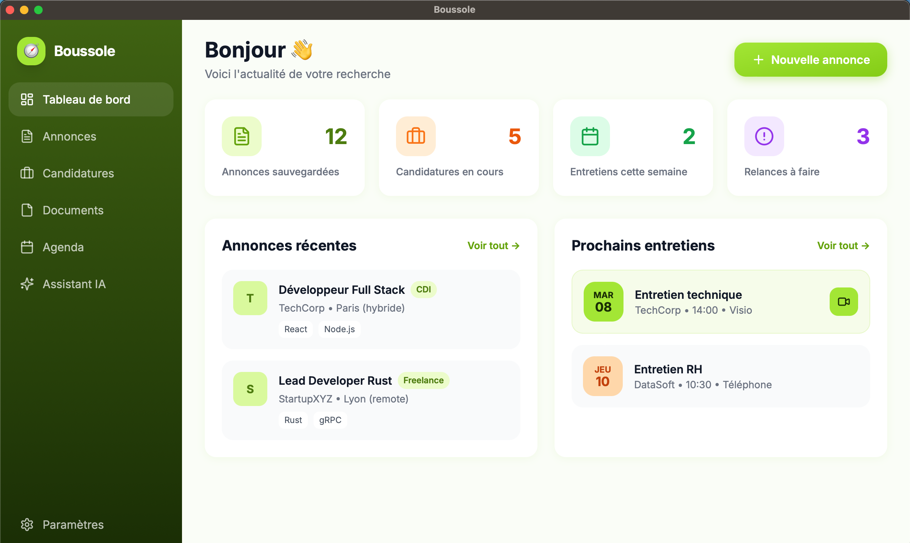

# 🧭 Boussole

Boussole est une application desktop légère, sécurisée et 100% locale conçue pour simplifier et structurer votre recherche d'emploi. Gérez vos candidatures, centralisez vos documents, générez des lettres de motivation sur mesure avec l'IA, synchronisez votre agenda Google et produisez des rapports PDF clairs pour vos justificatifs France Travail. Le tout, sans compromis sur votre vie privée.

## ✨ Fonctionnalités principales

- **📊 Tableau Kanban & suivi détaillé** : visualisez vos candidatures, ajoutez des notes, des tags et suivez chaque étape du processus.
- **📎 Sauvegarde d'annonces** : enregistrez les offres avec nom de la société, date, titre de l'annonce, localisation, salaire, type de contrat, télétravail, stack technique, site de parution, lien et description complète. Recherche performante par mots-clés.
- **🔗 Liaison annonces-candidatures** : associez une candidature à une annonce sauvegardée. Alertes si vous avez déjà postulé à cette société.
- **📄 Gestion documentaire** : CV multi-profiles (Chef de projet IT, Lead Dev, DevOps, etc.), versionning, import/export de pièces jointes.
- **🤖 Assistant IA (Gemini Flash)** : génération de lettres de motivation à la volée, analyse d'offres, préparation d'entretiens.
- **📅 Synchronisation Google Calendar** : vue unifiée de vos agendas, détection d'entretiens, rappels contextuels.
- **🇫🇷 Exports France Travail** : journal des démarches, génération de rapports PDF mensuels/trimestriels prêts à imprimer ou envoyer.
- **🔒 Local-first & sécurisé** : base SQLite chiffrée, fonctionnement hors-ligne, conformité RGPD, export/suppression totale des données.

**En cours de développement** :
- **📥 Import d'annonces** : copiez-collez simplement l'URL d'une offre pour l'enregistrer rapidement.

## 🛠️ Stack technique

- **🦀 Backend** : Rust (sqlx, serde, tokio)
- **🖥️ Frontend & Shell** : Tauri 2 + Svelte
- **💾 Base de données** : SQLite (stockage local)
- **🔐 Authentification** : OAuth 2.0 (Google Calendar)
- **🌐 IA** : Google Gemini Flash API
- **📦 Distribution** : Binaires natifs Windows / macOS / Linux

## �️ Git Hooks (sécurité)

Un hook pre-commit détecte automatiquement les secrets (clés API, tokens OAuth, clés privées…) avant chaque commit.

```bash
bash scripts/install-hooks.sh
```

> À exécuter une fois après le clone du repo. Le hook bloque tout commit contenant un secret détecté.

## �🔐 Connexion Google Calendar

Pour connecter un compte Google Calendar, consulte la doc dédiée : [Google Calendar OAuth](docs/google-calendar-oauth.md).

## Aperçu

<p align="center">
  
</p>

## Statut

🚧 En développement actif. Architecture définie, MVP en cours.

## Licence & Vie privée

Boussole stocke l'intégralité de vos données localement. Aucune donnée n'est envoyée vers des serveurs tiers, sauf lors de l'appel explicite à l'API Gemini pour la génération de texte (configurable). Respect strict du RGPD : export complet, suppression irréversible, chiffrement au repos.

## 💡 Conseils d'intégration GitHub

- **Section About** (à droite du repo) : colle la version courte. Ajoute les topics : `tauri`, `rust`, `svelte`, `job-search`, `local-first`, `privacy`, `gemini-api`, `france-travail`
